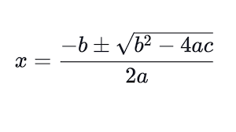

# Lesson 02 - Numeric Operations

## Topics

This lesson introduces:

- Integers
- Arithmetic Operators
  - Addition
  - Subtraction
  - Multiplication
  - Division
  - Modulus Division
- Concatenation with Arithmetic
- Floating Point Numbers
- The Java Math Library
  - Constants
  - sqrt
  - abs
  - pow
  - sin, cos, tan
  - asin, acos, atan
  - ceil, floor, round
  - exp, log, log10
  - max and min
  - hypot
  - atan2

## Read the Docs

You can read more:

- [Math Library](https://docs.oracle.com/en/java/javase/11/docs/api/java.base/java/lang/Math.html)

## Next Steps

After you get comfortable with the math library, integers, and floating point numbers, try these tasks.

In Algebra I, you learned about quadratic equations, those in the form ax^2 + bx + c = 0. You learned that the quadratic formula could be used to solve for x, producing 0, 1, or 2 real solutions.

The quadratic formula looks like this in plain text: x = (-b ± √(b^2 - 4ac)) / 2a

An image of the formula as it's usually seen in math texts is provided here:

Using Java and the quadratic formula, find the solutions to these problems:

    5x^2 + 6x + 1 = 0

    x^2 + 6x + 9 = 0

Before you get to coding, be aware that there is no "plus or minus" in Java, so you'll have to do two calculation for each problem.

- One solution is found with (-b + √(b^2 - 4ac)) / 2a
- One solution is found with (-b - √(b^2 - 4ac)) / 2a

If you want to check your work, the solutions to the first problem are -0.2 and -1. The answers to the second one are both -3. When checking your answers, keep the notes about floating point exactness in mind, and pay attention to your parentheses and operations!

You can add lines to the end of the App.java main method to run your code, replace the code inside the main method with your own, or create a new project.
