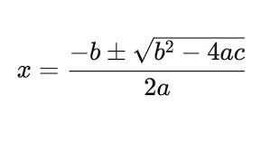

# Lesson 03 - Variables

## Topics

This lesson introduces:

- Variables
  - Declaration
  - Assignment
  - Initialization
- Types
  - int
  - byte
  - short
  - long
  - double
  - float
  - char
  - String
- Incrementing and Decrementing
- Objects
  - Methods
  - Null

## Read the Docs

You can read more:

- [The String Class](https://docs.oracle.com/en/java/javase/11/docs/api/java.base/java/lang/String.html)
- [Primitive Data Types](https://docs.oracle.com/javase/tutorial/java/nutsandbolts/datatypes.html)

This is a good demonstration of zero vs. null.

## Next Steps

For this lesson, you should redo the problems in lesson two. This time, you'll use variables and solve one problem at a time.

You should use a variable for each of a, b, and c. You should also create variables for the two x values. Finally, you should print the values.

You should first decide what type all of these variables should be.

If you need a refresher, the problems were:

    5x^2 + 6x + 1 = 0

    x^2 + 6x + 9 = 0

And the quadratic formula looks like this in plain text: x = (-b ± √(b^2 - 4ac)) / 2a

An image of the formula as it's usually seen in math texts is provided here:

Once you finish that, you can try making some other formulas work for you using variables.

For more practice with string, try figuring out how the substring methods work!
