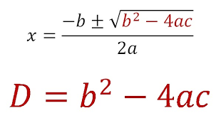

# Lesson 04 - Boolean Logic

## Topics

This lesson introduces:

- Constants
- Boolean values
- Boolean variables
- int comparison
- double comparison
- int equality
- double equality (and issues)
- String equality and equals()
- not operator
- and operator
- or operator

## Read the Docs

You can read more:

- [The String Class](https://docs.oracle.com/en/java/javase/11/docs/api/java.base/java/lang/String.html)
- [Primitive Data Types](https://docs.oracle.com/javase/tutorial/java/nutsandbolts/datatypes.html)
- [Operators](https://docs.oracle.com/javase/tutorial/java/nutsandbolts/op2.html)

## Next Steps

For this lesson, we'll revisit a specific part of the quadratic formula - the discriminant.

The discriminant, D, tells us if the equation will have 0, 1, or 2 real solutions.

The discriminant is given by: D = b^2 - 4ac.

An image of the formula as it's usually seen in math texts is provided here:

When using the discriminant, we care about when the value is 0, positive, or negative.

For each problem, print true or false for whether:

- The discriminant is equal to 0.
- The discriminant is less than 0.
- The discriminant is greater than 0.

Keep in mind that the calculation will be a double, so you can't check "equals 0" directly. You may want to refer to the notes on checking the equality of doubles. Generally, a good threshold value is 10^-6 (0.000001), written in Java as 1E-6.

The problems are:

    5x^2 + 6x + 1 = 0

    x^2 + 6x + 9 = 0

    5x^2 + 6x + 8 = 0
